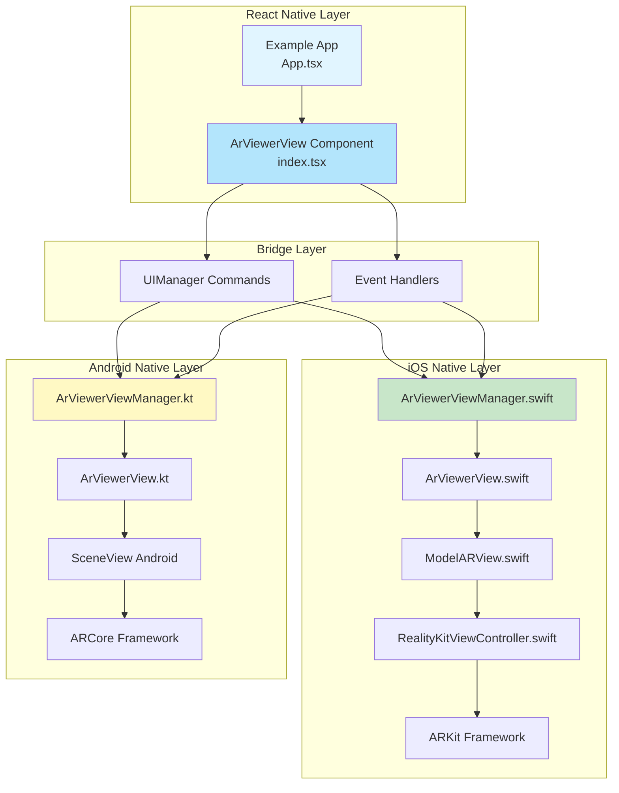
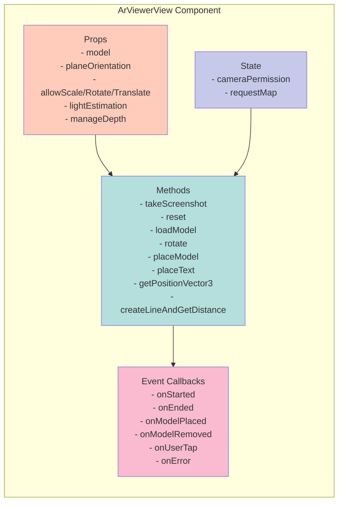
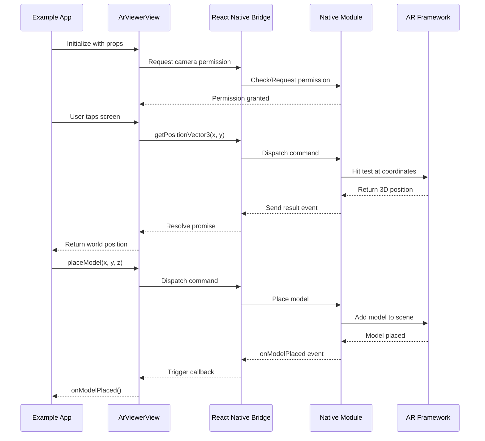
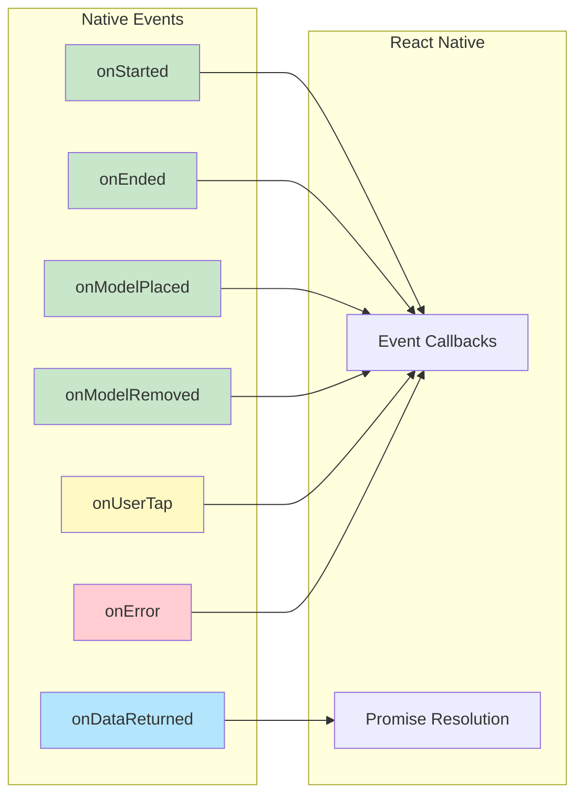
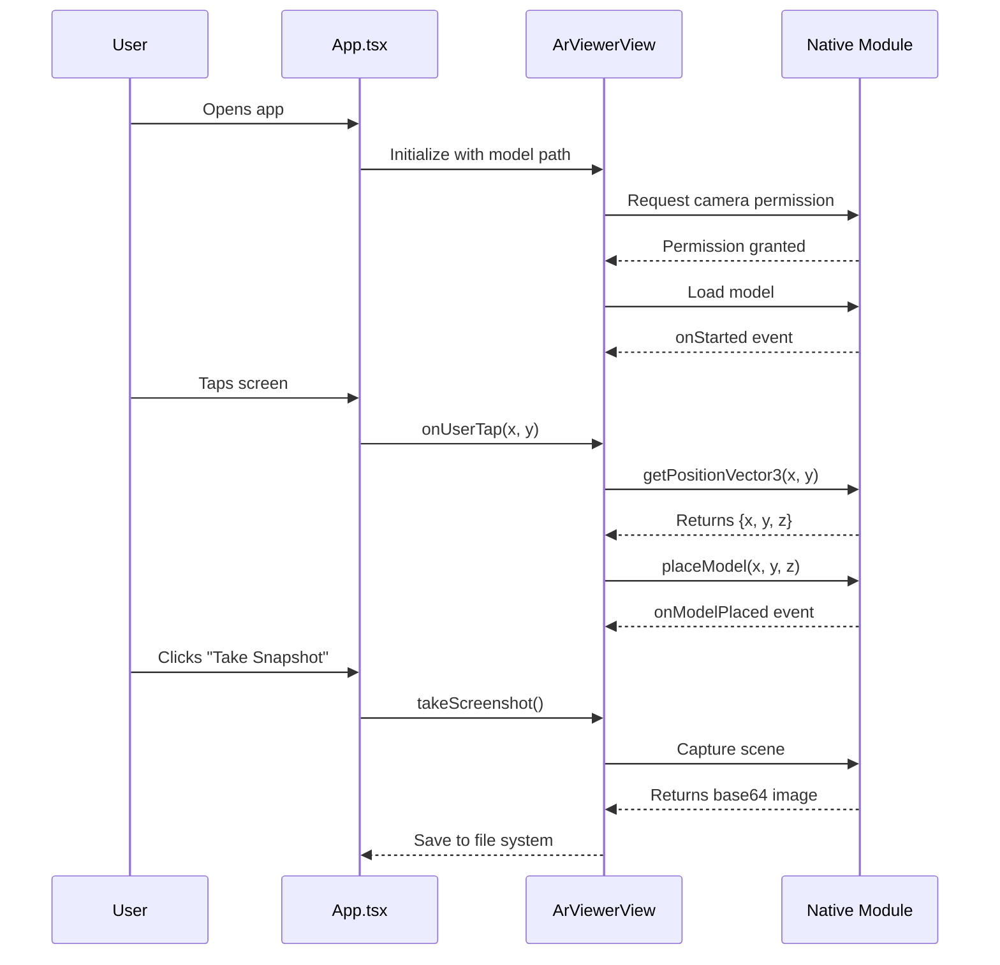

# React Native AR Viewer - Architecture Diagram

## Project Overview
A React Native library that provides AR (Augmented Reality) capabilities for both iOS and Android platforms, enabling 3D model viewing, placement, manipulation, and measurement in AR space.

---

## High-Level Architecture



---

## Component Structure

### 1. **React Native Layer**



### 2. **Data Flow**



---

## Feature Breakdown

### **Core Features**

| Feature | iOS | Android | Description |
|---------|-----|---------|-------------|
| **Model Loading** | ✅ | ✅ | Load USDZ (iOS) or GLB (Android) 3D models |
| **Model Placement** | ✅ | ✅ | Place models in AR space at specific coordinates |
| **Model Manipulation** | ✅ | ✅ | Scale, rotate, and translate models |
| **Screenshot** | ✅ | ✅ | Capture AR scene as base64 image |
| **Position Detection** | ✅ | ✅ | Convert 2D tap to 3D world coordinates |
| **Distance Measurement** | ✅ | ✅ | Draw line and measure distance between points |
| **Text Placement** | ✅ | ✅ | Place colored text labels in AR space |
| **Plane Detection** | ✅ | ✅ | Detect horizontal/vertical/both planes |
| **Light Estimation** | ✅ | ✅ | Realistic lighting based on environment |
| **Depth Management** | ✅ | ✅ | Occlusion and depth handling |

---

## File Structure

```
react-native-ar-main/
│
├── src/
│   └── index.tsx                    # Main React Native component
│
├── ios/
│   ├── ArViewerViewManager.swift    # iOS view manager
│   ├── ArViewerView.swift           # iOS view wrapper
│   ├── ModelARView.swift            # Main AR view implementation
│   ├── RealityKitViewController.swift
│   ├── DistanceUnit.swift           # Distance measurement utilities
│   └── Grid.swift                   # Grid overlay
│
├── android/
│   └── src/
│       └── main/
│           └── java/com/arviewer/
│               ├── ArViewerViewManager.kt
│               ├── ArViewerView.kt
│               └── [SceneView integration]
│
├── example/
│   └── src/
│       └── App.tsx                  # Example implementation
│
└── docs/                            # Documentation
```

---

## Command Flow

### **Available Commands**

```mermaid
graph TD
    Commands[UIManager Commands]
    
    Commands --> Screenshot[takeScreenshot<br/>Returns: base64 image]
    Commands --> Reset[reset<br/>Resets model position]
    Commands --> Load[loadModel<br/>Loads 3D model]
    Commands --> Rotate[rotateModel<br/>Params: pitch, yaw, roll]
    Commands --> Place[placeModel<br/>Params: x, y, z]
    Commands --> Text[placeText<br/>Params: x, y, z, color, text]
    Commands --> Position[getPositionVector3<br/>Params: x, y<br/>Returns: {x, y, z}]
    Commands --> Distance[createLineAndGetDistance<br/>Params: pos1, pos2, color<br/>Returns: distance]
    
    style Screenshot fill:#b2ebf2
    style Position fill:#b2ebf2
    style Distance fill:#b2ebf2
    style Reset fill:#ffccbc
    style Load fill:#ffccbc
    style Rotate fill:#c5cae9
    style Place fill:#c5cae9
    style Text fill:#c5cae9
```

---

## Event System

### **Event Flow**



---

## Platform-Specific Implementation

### **iOS Stack**
```
App.tsx
  ↓
ArViewerView (React Native)
  ↓
ArViewerViewManager.swift (Bridge)
  ↓
ArViewerView.swift (UIView wrapper)
  ↓
ModelARView.swift (ARView implementation)
  ↓
RealityKit + ARKit (Apple Frameworks)
```

### **Android Stack**
```
App.tsx
  ↓
ArViewerView (React Native)
  ↓
ArViewerViewManager.kt (Bridge)
  ↓
ArViewerView.kt (View wrapper)
  ↓
SceneView (SceneView Android)
  ↓
ARCore (Google Framework)
```

---

## Key Technologies

| Layer | iOS | Android | React Native |
|-------|-----|---------|--------------|
| **Language** | Swift | Kotlin | TypeScript |
| **AR Framework** | ARKit + RealityKit | ARCore + SceneView | - |
| **3D Format** | USDZ | GLB/GLTF | - |
| **Bridge** | Objective-C Bridge | JNI Bridge | UIManager |
| **Permissions** | Camera (Info.plist) | Camera (Manifest) | PermissionsAndroid |

---

## Example Usage Flow



---

## Summary

This React Native AR Viewer library provides a **cross-platform AR solution** that:

- ✅ Bridges React Native with native AR frameworks (ARKit for iOS, ARCore for Android)
- ✅ Supports 3D model loading, placement, and manipulation
- ✅ Enables distance measurement and text annotation in AR space
- ✅ Provides real-time interaction through tap detection and position tracking
- ✅ Handles platform-specific implementations transparently
- ✅ Uses promise-based async communication for complex operations
- ✅ Implements proper permission handling for camera access

The architecture follows React Native best practices with a clear separation between the JavaScript layer, bridge layer, and native implementations.
